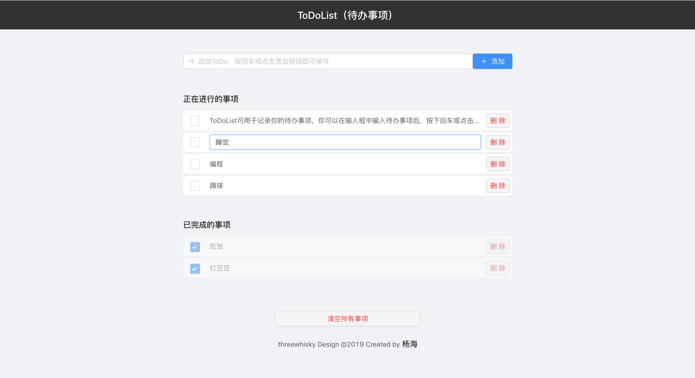

# ToDoList

 

## 如何运行ToDoList
1. 打开你准备存储这个项目的文件夹然后将项目克隆到本地。（或者下载压缩包到文件夹中）  
`git clone git@github.com:threewhisky/ToDoList.git  `  
然后切换到项目根目录  
`cd ToDoList`

2. 安装依赖  
`npm install`  
或使用淘宝镜像（更快速稳定）  
`cnpm install`

3. 执行运行命令  
`npm start`  

4. 在浏览器中打开 http://localhost:3000/ ，便可以开始使用 **ToDoList** 。  

 

## ToDoList的基本使用方法
1. 在**input输入框**中输入你的待办事项，然后按下**回车**或者点击输入框右边的**添加按钮**，该待办事项就会自动添加到 *正在进行的事项* 列表中。 

2. 点击事项左侧的**checkbox方框**，即可将该事项移动到 *已完成的事项* 列表中。

3. **双击事项的内容**，即可重新编辑该事项的内容。

4. 点击事项右侧的**删除按钮**，便会将该事项从你的待办事项中**移除**（注意是删除事项，不是添加到完成列表中）。
  

5. 在 *已完成的事项* 列表中你可以点击已完成事项左侧的**checkbox方框**，便会将该事项重新移入 *正在进行的事项* 列表中。

6. 在 *已完成的事项* 列表中**双击事项的内容**，即可重新编辑该事项的内容并在编辑完后将该事项重新移入 *正在进行的事项* 列表中。

7. 在 *已完成的事项* 列表中点击事项右侧的**删除按钮**，便会将该事项从你的待办事项中**移除**。

8. 点击页面底部的**清空所有事项按钮**，便会将页面内所有的事项**全部移除**，且**不可恢复**（慎点）。

 

## 该项目(ToDoList)的亮点
1. 使用 React 搭建，借助 Ant Design UI 对页面进行设计，页面精美。

2. 对组件进行合理拆分，方便继续维护改良，减少代码耦合性，且在细节处进行性能优化，提高了运行效率。

3. 该项目完美适配移动端！由于项目使用的是flex弹性布局，使其在不同大小的窗口或移动端上都有良好的展示效果。

4. ToDoList允许用户管理待办事项列表（CRUD）
   - 查看待办事项
   - 将新的待办事项添加到列表中
   - 双击编辑待办事项
   - 从列表中删除待办事项

5. ToDoList使用HTML5的本地储存新特性，使你刷新页面也不会丢失数据。

6. 将数据分类成 *正在进行的事项* 和 *已完成的事项* ，大幅提高了用户体验。

7. 在细节处提高用户体验：  
    - 待办事项的内容做了溢出文本打点处理。
    - 双击编辑事项时输入单引号非常规字符也可正常编辑显示。
    - 阻止双击编辑事件冒泡，在编辑事项时双击也不会出现意料之外的结果。

## 写在最后
> 如果你觉得对你有帮助，点击页面右上角的 **Star** 我就能收到你的心意！ 
